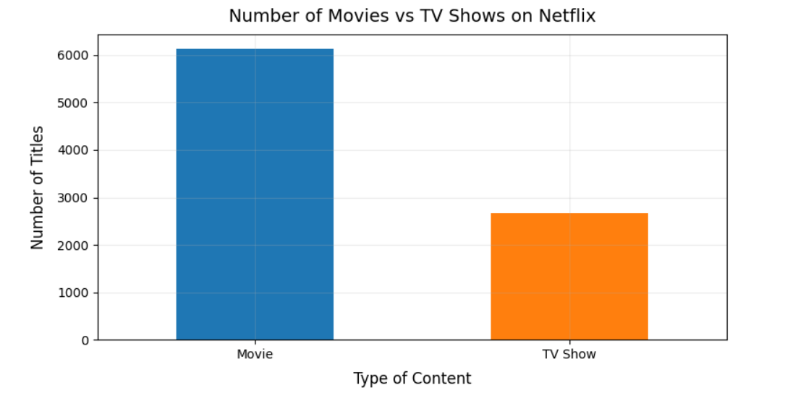
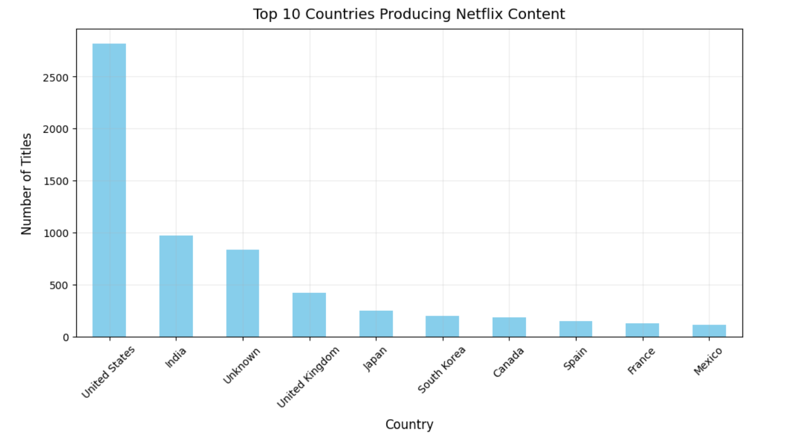
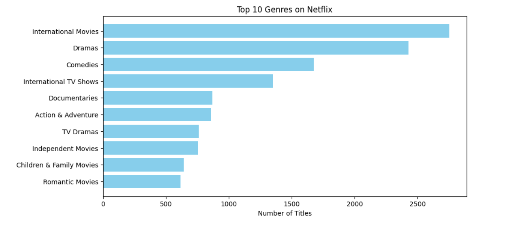
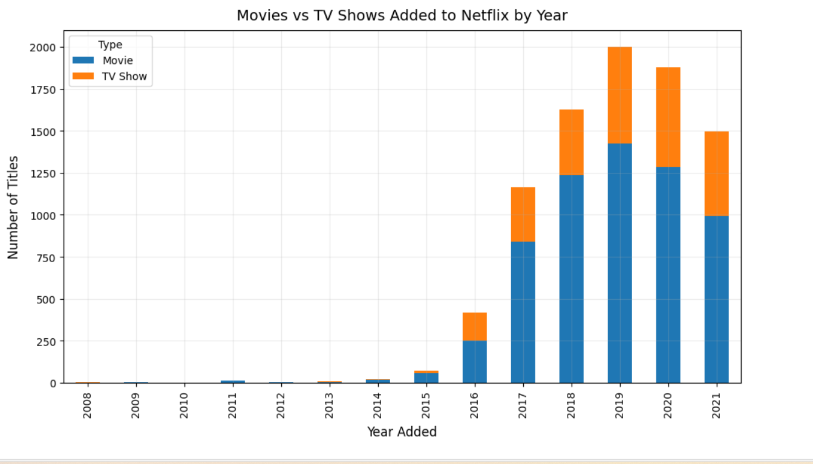

# Netflix Content Analysis using Python

## 📌 Project Overview
This project performs an **Exploratory Data Analysis (EDA)** on Netflix's global catalog of movies and TV shows to uncover trends in content types, genres, ratings, durations, and production countries.

The analysis was done entirely in **Python**, using Pandas, NumPy, Matplotlib, and Seaborn for data cleaning, transformation, and visualization.

## 📂 Dataset
- **Source:** [Netflix Movies and TV Shows — Kaggle](https://www.kaggle.com/datasets/shivamb/netflix-shows)  
- **File in this repo:**
  - `netflix_titles.csv` → Original dataset from Kaggle (data cleaning is performed within the notebook)

## 🛠️ Tools & Libraries Used
- **Python**: Pandas, NumPy, Matplotlib, Seaborn
- **Jupyter Notebook**

## 📊 Key Insights
- Movies dominate Netflix's catalog, but TV shows have grown steadily in recent years.
- Content additions surged after 2016, with a peak in 2019.
- **TV-MA** and **TV-14** are the most frequent ratings, showing a focus on mature/teen audiences.
- **United States** and **India** are the top producers of Netflix content.
- Most movies are 80–120 minutes long, and most TV shows have only 1 season.
- International Movies, Dramas, and Comedies are the most common genres.

## 📷 Sample Visualizations
  
  
  
  
## 🚀 How to Run This Project
1. Clone this repository:
   ```bash
   git clone https://github.com/yourusername/netflix-content-analysis.git
